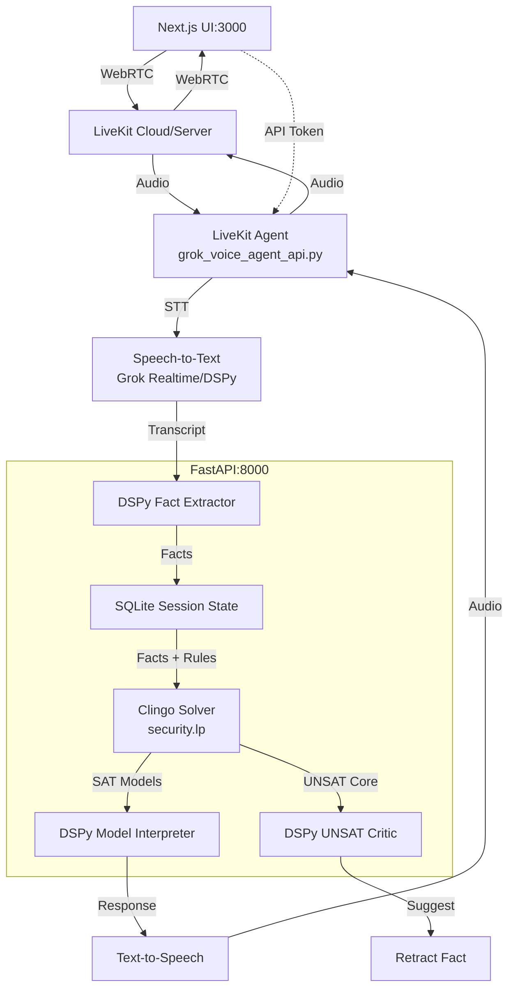

# LiveLogic Formal System Model

## Overview

This document outlines the formal Answer Set Programming (ASP) model for the entire LiveLogic system. The model serves as an executable specification capturing components, states, events, data flows, and behaviors. It enables simulation, verification, and guides Phase 3 implementation.

The model will be in [`reasoner/asp/system_model.lp`](reasoner/asp/system_model.lp).

## Current System Architecture



## Proposed ASP Model Structure

### Core Predicates (continued)

```
... [previous code]
```

### Voice Input Pipeline Model

```
% Specific transitions for voice input
trans(ui, idle, connected, connect_event).
trans(ui, connected, speaking, user_intent).
trans(livekit, idle, streaming, connect_event).
trans(livekit, streaming, streaming, user_speak).
trans(agent, listening, processing, user_speak).
trans(agent, processing, waiting_stt, user_speak).
trans(stt, idle, transcribing, user_speak).
trans(stt, transcribing, idle, transcript_ready).
trans(dspy_extract, idle, extracting, transcript_ready).
trans(dspy_extract, extracting, idle, fact_extracted).
trans(session_db, accumulating, accumulating, fact_extracted).

% Trigger chain
occurs(connect_event, 0).
occurs(user_speak, transcript("User John accessed DB"), 1).
occurs(transcript_ready, transcript("User John accessed DB"), 2).
occurs(fact_extracted, fact(user(john). has_role(john, analyst).), 3).
```

### Neuro-Symbolic Reasoner Model

```
% Reasoner transitions
trans(clingo, idle, solving, facts_ready).
trans(clingo, solving, sat, solve_sat).
trans(clingo, solving, unsat, solve_unsat).
trans(dspy_critic, idle, critiquing, solve_unsat).
trans(dspy_critic, critiquing, idle, retraction_suggested).
trans(dspy_interpret, idle, interpreting, solve_sat).
trans(dspy_interpret, interpreting, idle, response_ready).

% Facts ready from session_db
facts_ready :- holds_state(session_db, accumulating, _).

% Branching on SAT/UNSAT
occurs(solve_sat, Models) :- facts_ready, consistent.
occurs(solve_unsat, Core) :- facts_ready, inconsistent.
```

### Output and Feedback Model

```
% Output pipeline
trans(tts, idle, synthesizing, response_ready).
trans(tts, synthesizing, idle, audio_ready).
trans(agent, waiting_response, speaking, audio_ready).
trans(livekit, streaming, streaming, audio_ready).
trans(ui, connected, listening, audio_ready).

% Retraction
trans(session_db, accumulating, retracted, retract_fact).
trans(agent, speaking, listening, retraction_confirmed).
```

## Key Properties to Verify (ASP Constraints)

```
:- not response_ready, holds_state(ui, speaking, S), step(S > 5).  %% Liveness
:- holds_state(clingo, conflicted, S), step(S > 10).             %% Safety
:- holds_state(session_db, accumulating, S), inconsistent(S).    %% Consistency
```

## Simulation Queries and Traces

```
%% Sample interaction
transcript("John accessed DB at 3AM").
user_speak :- transcript(_).

#show holds_state/3.
#show occurs/2.

%% Query: trace a full cycle
?- holds_state(tts, synthesizing, S).
```

## Guided Phase 3 Implementation Steps

1. Update [`agent/livekit_agent.py`](agent/livekit_agent.py): integrate Deepgram STT, POST [`reasoner/app/main.py`](reasoner/app/main.py):/reason, TTS response.
2. Add VAD interruption detection → POST /retract.
3. Play filler audio (&quot;Analyzing...&quot;) during processing.
4. Use participant.identity as session_id.
5. Frontend: display traces from /trace/{session_id}.
6. Validate against model: simulate in Clingo, ensure code matches transitions.
7. Test end-to-end voice reasoning on security queries.

## Next Actions

- Create [`reasoner/asp/system_model.lp`](reasoner/asp/system_model.lp) from this spec.
- Switch to code mode.
- Update README roadmap.

## Relation to Todo List

This aligns with todo steps 2-11. Core predicates now defined.

## Sample Query

```
#show holds_state/3.
?- holds_state(agent, responding, S).
```

Updated [`README.md`](README.md) roadmap: Phase 3 now guided by formal model.
